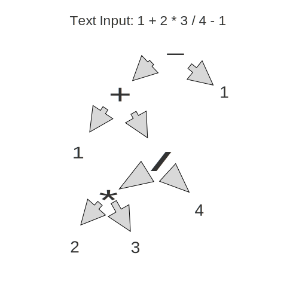

Godot Calculator
=

This calculator uses an **Abstract Syntax Tree** to order  the flow of operations. As a consequence, operations such as Minus/Add are near the root of the tree while multiply/divide will tend to be near the leaves of the tree.

